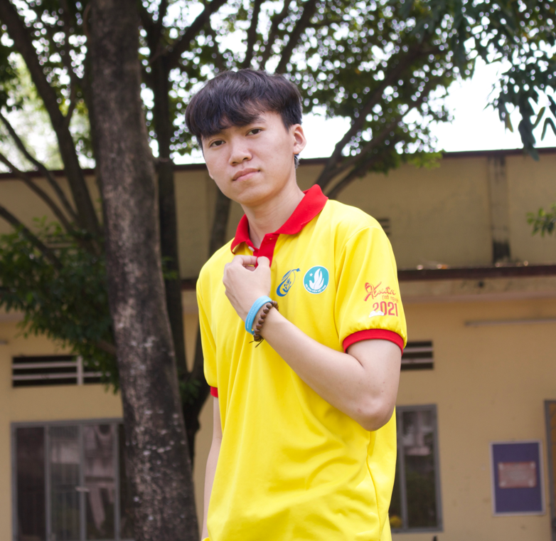

<!--
**QuocBao1097/QuocBao1097** is a ✨ _special_ ✨ repository because its `README.md` (this file) appears on your GitHub profile.

Here are some ideas to get you started:

- 🔭 I’m currently working on ...asas
- 🌱 I’m currently learning ...
- 👯 I’m looking to collaborate on ...
- 🤔 I’m looking for help with ...
- 💬 Ask me about ...
- 📫 How to reach me: ...
- 😄 Pronouns: ...
- ⚡ Fun fact: ...
-->

<h1 align="center">Hi 👋, I'm Doan Quoc Bao</h1>
<h4 align="center">Thank you for visiting my github</h4>

- ✍ I'm a student of: University of Information Technology ---> https://uit.edu.vn/

- 🌱 I’m currently learning: Ruby on Rails
- 💬 How to reach me: <a href="mailto:baodq.dev@gmai.com" alt="Email">baodq.dev@gmail.com</a>
- ⚡ My linkedin: <a href="https://www.linkedin.com/in/lluvh/" target="_blank">https://www.linkedin.com/in/lluvh/</a>
## Technical Skills:

 
 
 
 
 
 
 
 
 
 
 
 
 
 
 
 
 
 

<table style="width:100%">
<!--   <tr>
    <td>
      
      
    </td> -->
<!--     <td>
      
 
        
      

    </td> -->
<!--   </tr> -->
<!-- </table> -->
